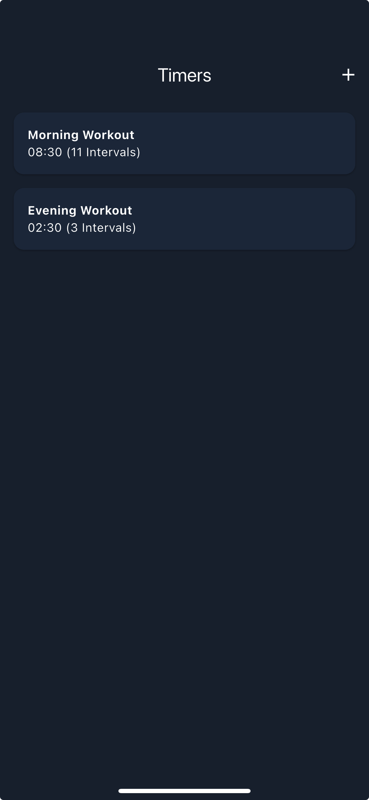

# Interval Timer

Interval Timer is an iOS app created using Flutter, which let's you create
timers with multiple intervals.

<div align="center">
  <table>
    <tr>
      <td></td>
      <td></td>
      <td></td>
    </tr>
  </table>
</div>

```bash
# Launch emulator and run the app
flutter emulators --launch apple_ios_simulator
flutter run -d "iPhone 15"

# Run the app on a device
flutter devices
flutter run --device-id=<DEVICE>
flutter run --release --device-id=<DEVICE>

# Sort imports
flutter pub run import_sorter:main

# Generate app icons and splash screen
flutter pub run flutter_launcher_icons:main
flutter pub run flutter_native_splash:create
```
